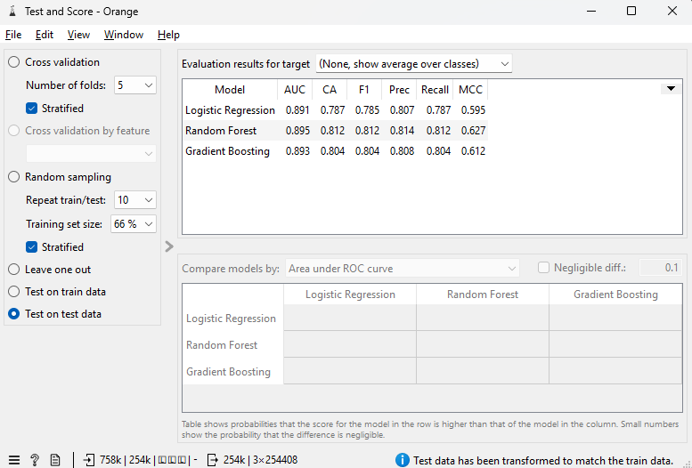
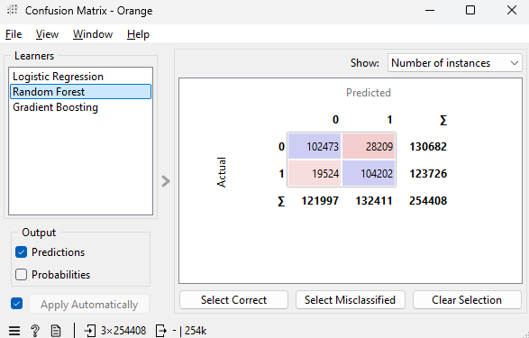
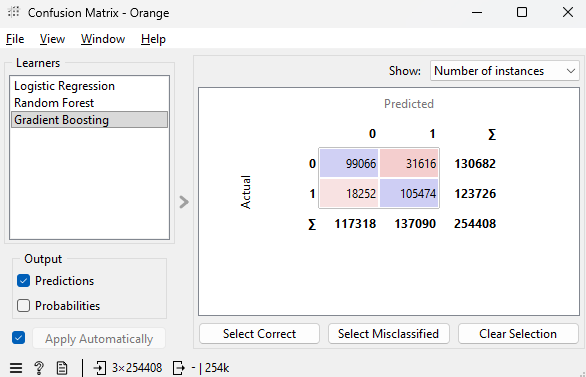
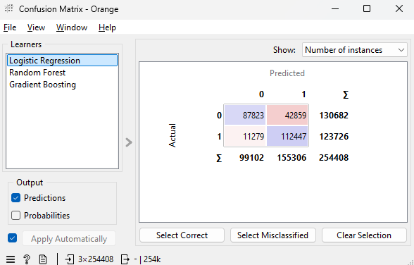
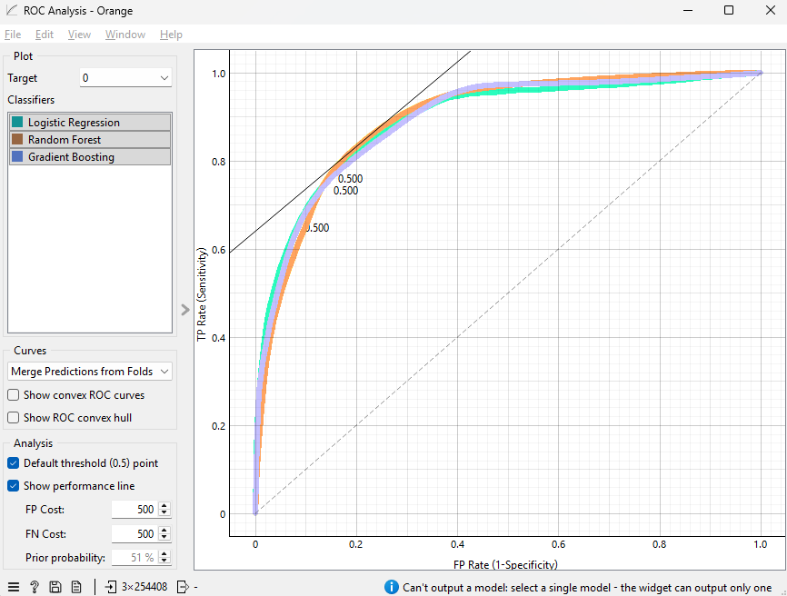

# Orange Data Mining — Pipeline visual de Modelado

Esta carpeta contiene el flujo de Orange Data Mining que reproduce la fase **Modeling** de CRISP-DM con widgets visuales (sin código), tomando como entrada los CSV pre-procesados que genera el script preparador. Es el equivalente visual del notebook `05_modelado.ipynb`.

---

## Contenido

```
orange/
├── pipeline_ocupacion.ows         # Flujo de Orange (abrir con doble clic)
├── preparar_dataset_orange.py     # Script que genera train.csv y test.csv
├── images/                        # Capturas del flujo y de los resultados
│   ├── test_and_score.png
│   ├── confusion_matrix_random_forest.png
│   ├── confusion_matrix_gardient_boosting.png
│   ├── confusion_matrix_logistic_regression.png
│   └── roc_analysis.png
└── README.md                      # Este documento
```

---

## ¿Por qué Orange además de scikit-learn?

El curso pide demostrar dominio de **dos enfoques de Machine Learning**: uno programático (scikit-learn en el notebook 05) y otro visual (Orange Data Mining). Trabajar con los dos en paralelo aporta tres cosas:

1. **Validación cruzada de implementación.** Si el flujo visual y el código dan métricas equivalentes, gana confianza en que el pipeline es correcto y reproducible.
2. **Comunicación con perfiles no técnicos.** Un flujo de Orange se entiende leyendo la imagen sin saber Python.
3. **Velocidad para iterar hiperparámetros.** Cambiar un parámetro en Orange y ver el impacto en las métricas es inmediato; en código requiere editar y re-ejecutar.

---

## Prerequisitos

1. **Orange Data Mining 3.x** instalado. Descarga gratuita en https://orangedatamining.com/download/ (~250 MB, multiplataforma).
2. `dataset_integrado.csv` generado por el notebook `04_integracion.ipynb`.
3. Entorno virtual del proyecto con las dependencias de `requirements.txt` (pandas, numpy).

---

## Paso 1 — Generar los CSV de entrada

Orange consume CSV planos. Para que las métricas sean coherentes con el notebook 05 (F1≈0.81, AUC≈0.89), el flujo no puede aplicar el feature engineering desde dentro de Orange — los target encodings necesitan calcularse **solo con los datos de train** para no incurrir en *data leakage*. Por eso lo hacemos en Python con un script externo:

```bash
# Desde la raíz del repo, con el venv activo
python orange/preparar_dataset_orange.py
```

El script (`preparar_dataset_orange.py`) replica el feature engineering del notebook 05 paso a paso:

1. **Carga** `data/processed/dataset_integrado.csv` (1.012.783 filas × 40 cols).
2. **Split por fecha** en `2026-01-25`: train = 758.375 filas (42 días), test = 254.408 filas (14 días).
3. **Target encoding por barrio** (`neigh_enc`): media de ocupación de cada barrio calculada **solo con train**.
4. **Target encoding por listing** (`listing_te`): media de ocupación de cada piso calculada **solo con train**. Los listings nuevos (no vistos) caerían a la media global, pero en este dataset *cold start* = 0 (todos los pisos aparecen en ambas particiones).
5. **One-hot encoding** de `room_type`, `property_type`, `weather_cat`, `neighbourhood_group_cleansed`.
6. **Drop de columnas con leakage**: `availability_30/60/90/365` y `estimated_occupancy_l365d` salen del propio `calendar.csv` y son proxies directos del target.
7. **Drop de identificadores** (`listing_id`, `date`) tras usarlos para los encodings.
8. **Escribe** `data/processed/train.csv` (~139 MB, 758.375 × 56) y `data/processed/test.csv` (~13 MB, 254.408 × 56). La columna `occupied` queda en primera posición.

Output esperado del script:

```
[IN ] Cargado dataset_integrado.csv: 1,012,783 filas × 40 cols
[SPL] Split 2026-01-25: train=758,375  test=254,408
[TE ] global_mean=0.5603  barrios_train=71  listings_train=18172  listings_cold_start_en_test=0
[OUT] train.csv  →    758,375 filas × 56 cols
[OUT] test.csv   →    254,408 filas × 56 cols
[OUT] target balance train: 56.03% ocupado
[OUT] target balance test : 48.63% ocupado
```

Comentario sobre el balance del target: el train cubre Navidad/Reyes (alta demanda → 56% ocupado) y el test las dos primeras semanas de febrero (baja demanda → 49%). El modelo se evalúa, intencionadamente, contra un periodo de menor demanda — eso simula un escenario realista de predicción fuera de temporada alta.

---

## Paso 2 — Construir el flujo en Orange

Abrir Orange y arrastrar widgets desde el panel lateral. El layout final tiene 8 widgets y 8 conexiones.

```
File(train.csv) ─[Data]→ Select Columns ─[Data]──┐
                                                  ├──→ Test and Score ─[Eval Results]→ Confusion Matrix
File(test.csv) ──────────[Test Data]──────────────┤                  └─[Eval Results]→ ROC Analysis
                                                  │
Logistic Regression ────[Learner]─────────────────┤
Random Forest       ────[Learner]─────────────────┤
Gradient Boosting   ────[Learner]─────────────────┘
```

### Conexiones, una a una

| # | Origen              | Destino           | Canal             |
|---|---------------------|-------------------|-------------------|
| 1 | File train          | Select Columns    | Data → Data       |
| 2 | Select Columns      | Test and Score    | Data → Data       |
| 3 | File test           | Test and Score    | Data → **Test Data** |
| 4 | Logistic Regression | Test and Score    | Learner           |
| 5 | Random Forest       | Test and Score    | Learner           |
| 6 | Gradient Boosting   | Test and Score    | Learner           |
| 7 | Test and Score      | Confusion Matrix  | Evaluation Results|
| 8 | Test and Score      | ROC Analysis      | Evaluation Results|

La conexión #3 es la más sensible: cuando se arrastra de `File test` a `Test and Score`, Orange abre un diálogo de selección de canal porque ambos widgets aceptan `Data`. Hay que cambiarlo manualmente a **`Data → Test Data`**, si no Orange interpretará el test como un segundo train y dará resultados absurdos.

### Marcar el target en los dos `File`

Orange necesita saber que `occupied` es la variable a predecir, **tanto en el train como en el test**. En cada widget `File`, abrir el diálogo, localizar la fila `occupied` en la tabla inferior de columnas, y cambiar su rol de `feature` a `target`. Si no se hace en el test, sale el error *"Test data input requires a target value"*.

---

## Paso 3 — Configurar los modelos

Los hiperparámetros son idénticos a los del notebook 05 para que las métricas sean comparables. Se accede haciendo doble clic en cada widget de modelo.

### Logistic Regression

| Parámetro | Valor | Por qué |
|---|---|---|
| Regularization type | Ridge (L2) | Default de sklearn. L2 penaliza coeficientes grandes y previene overfitting. |
| Strength (C) | 1 | Default de sklearn. Valores más bajos regularizan más. |
| Balance class distribution | Desmarcado | La clase `ocupado` es 56% del train, no es desbalanceo grave. Marcar esta casilla equivale a `class_weight='balanced'` en sklearn, que penaliza la mayoritaria y empeora F1. |

### Random Forest

| Parámetro | Valor | Impacto si se cambia |
|---|---|---|
| Number of trees | 200 | Más árboles → más estable, más lento. <100 da varianza alta entre ejecuciones; >500 apenas mejora. |
| Number of attributes considered at each split | Sin marcar (sqrt) | Default de sklearn = `sqrt(n_features)`. Limitar a un número fijo (p. ej. 15) puede ayudar en datasets ruidosos. |
| Limit depth of individual trees | 15 | Sin límite, los árboles crecen hasta hojas puras → overfitting. Con 15, el bosque generaliza mejor en test. |
| Do not split subsets smaller than | 5 | Hojas con menos de 5 muestras se vuelven ruido. Subir a 20 simplifica el modelo (menos overfitting) pero pierde detalle. |
| Replicable training | Marcado | Fija la semilla del random_state. Sin marcar, las métricas oscilan ±0.5 puntos entre ejecuciones. |
| Balance class distribution | Desmarcado | Mismo razonamiento que Logistic Regression. |

### Gradient Boosting

| Parámetro | Valor | Impacto si se cambia |
|---|---|---|
| Method | Gradient Boosting (scikit-learn) | El backend más estable y comparable con el notebook. |
| Number of trees | 200 | Cada árbol corrige errores del anterior. <100 underfit; >500 puede sobreajustar. |
| Learning rate | 0.10 | Cuánto pesa cada árbol nuevo. Combinarlo con `n_trees`: 0.05 + 400 árboles ≈ 0.10 + 200 árboles, pero el primero suele generalizar un pelín mejor. |
| Limit depth | 5 | Árboles superficiales fuerzan al modelo a aprender patrones simples y combinarlos. Más profundidad → overfitting rápido. |
| Do not split subsets smaller than | 2 | Default de sklearn. |
| Replicable training | Marcado | Misma motivación que en RF. |
| Fraction of training instances | 1.00 | Usar el 100% de las muestras en cada iteración. <1.0 introduce stochastic gradient boosting (más rápido, ligeramente más estable). |

---

## Paso 4 — Evaluar (`Test and Score`)

Configuración crítica en el panel lateral izquierdo del widget:

- **Sampling = `Test on test data`**. Por defecto Orange hace cross-validation sobre el train; aquí queremos evaluar contra el `File test` real.
- Métricas marcadas: **AUC**, **CA** (accuracy), **F1**, **Precision**, **Recall**, **MCC**.

El widget tarda unos minutos por culpa del Random Forest y el Gradient Boosting con 200 árboles cada uno sobre 758k filas. La tabla de salida tiene una fila por modelo:

| Modelo              | AUC   | CA    | F1    | Precision | Recall | MCC   |
|---------------------|------:|------:|------:|----------:|-------:|------:|
| Logistic Regression | 0.891 | 0.787 | 0.785 | 0.807     | 0.787  | 0.595 |
| Random Forest       | **0.895** | **0.812** | **0.812** | **0.814** | 0.812  | **0.627** |
| Gradient Boosting   | 0.893 | 0.804 | 0.804 | 0.808     | 0.804  | 0.612 |

**Lectura.** Random Forest gana en todas las métricas balanceadas (CA, F1, MCC) y empata virtualmente con Gradient Boosting en AUC. Los tres modelos cumplen los umbrales del curso (F1 ≥ 0.75, AUC ≥ 0.80) con holgura. El MCC (Matthews Correlation Coefficient) es la métrica más estricta en clasificación binaria — un MCC de 0.62 indica una correlación claramente positiva entre predicciones y etiquetas reales.

Captura del widget: 

---

## Paso 5 — Matrices de confusión

`Confusion Matrix` muestra para cada modelo la tabla 2×2 de aciertos y errores. El dropdown superior izquierdo (`Learners`) permite alternar entre los tres modelos.

### Convenciones

- **Filas = clase real** (`Actual`): 0 = libre, 1 = ocupado.
- **Columnas = clase predicha** (`Predicted`): 0 = libre, 1 = ocupado.
- La diagonal son los aciertos; los off-diagonal son errores.

El test contiene **254.408 filas**, repartidas entre **130.682 noches realmente libres** y **123.726 noches realmente ocupadas** (49% ocupación, baja demanda de febrero).

### Random Forest — el ganador

|                | Pred. libre (0) | Pred. ocupado (1) | Total real |
|----------------|----------------:|------------------:|-----------:|
| **Real libre (0)**    | 102.473 ✓ | 28.209 ✗ (FP) | 130.682 |
| **Real ocupado (1)**  |  19.524 ✗ (FN) | 104.202 ✓ | 123.726 |
| **Total predicho**    | 121.997 | 132.411 | **254.408** |

- Aciertos totales: 102.473 + 104.202 = **206.675 (81.2% accuracy)**, coherente con la CA del Test and Score.
- **Recall de ocupados** = 104.202 / 123.726 = 84.2%. De cada 100 noches realmente ocupadas, el modelo detecta 84.
- **Precision de ocupados** = 104.202 / 132.411 = 78.7%. De cada 100 noches que el modelo etiqueta como ocupadas, 79 lo son de verdad.
- Errores casi simétricos (28k FP vs 20k FN). Modelo equilibrado.

Captura: 

### Gradient Boosting — segundo, ligeramente más agresivo

|                | Pred. libre (0) | Pred. ocupado (1) | Total real |
|----------------|----------------:|------------------:|-----------:|
| **Real libre (0)**    |  99.066 ✓ | 31.616 ✗ (FP) | 130.682 |
| **Real ocupado (1)**  |  18.252 ✗ (FN) | 105.474 ✓ | 123.726 |
| **Total predicho**    | 117.318 | 137.090 | **254.408** |

Comparado con RF: detecta 1.272 ocupados más (mejor recall: 85.2%) pero a costa de 3.407 falsos positivos extra (peor precision: 76.9%). Balance final ligeramente peor en F1.

Captura: 

### Logistic Regression — la más agresiva, mejor recall

|                | Pred. libre (0) | Pred. ocupado (1) | Total real |
|----------------|----------------:|------------------:|-----------:|
| **Real libre (0)**    |  87.823 ✓ | 42.859 ✗ (FP) | 130.682 |
| **Real ocupado (1)**  |  11.279 ✗ (FN) | 112.447 ✓ | 123.726 |
| **Total predicho**    |  99.102 | 155.306 | **254.408** |

LR predice **155k ocupados** (vs 132k del RF y 137k del GB). Detecta el **90.9% de los ocupados reales** (mejor recall absoluto), pero confunde 33% de los libres como ocupados (precision 72.4%). Es un clasificador "optimista" que minimiza falsos negativos a cambio de muchos falsos positivos.

Captura: 

### Trade-off precision vs recall

Cuál modelo conviene depende del coste de cada error:

- **Si interesa NO molestar al anfitrión cuando el piso está realmente libre** (alta precisión): Random Forest. Es el menos propenso a falsos positivos.
- **Si interesa NO perder ninguna oportunidad de reserva potencial** (alto recall): Logistic Regression. Detecta más ocupados a costa de marcar muchos libres como ocupados.
- **Para un caso de uso de pricing dinámico** (objetivo equilibrado): Random Forest, que combina las dos métricas mejor.

---

## Paso 6 — Análisis ROC

La curva ROC (*Receiver Operating Characteristic*) responde a una pregunta: **¿qué tan bien separa el modelo las dos clases con cualquier umbral de decisión posible?**

Captura: 

### Cómo se lee una curva ROC (explicación didáctica)

Cada modelo de clasificación binaria devuelve, para cada fila, una **probabilidad** entre 0 y 1 de pertenecer a la clase positiva (en este caso, "ocupado"). Para convertir esa probabilidad en una predicción 0/1 hay que elegir un **umbral** (threshold), normalmente 0.5.

Cambiar el umbral mueve el balance entre dos tipos de error:

- **Bajar el umbral** (p. ej. 0.3): el modelo predice "ocupado" más a menudo. Sube el *recall* (detecta más positivos reales) pero también sube la *tasa de falsos positivos*.
- **Subir el umbral** (p. ej. 0.7): el modelo predice "ocupado" menos. Baja la tasa de falsos positivos pero baja el recall.

La curva ROC barre **todos los umbrales posibles** y dibuja, para cada uno, dos coordenadas:

- **Eje X = `FP Rate (1-Specificity)`**: proporción de libres clasificados erróneamente como ocupados.
- **Eje Y = `TP Rate (Sensitivity)`**: proporción de ocupados clasificados correctamente.

Esquinas de referencia:

- **(0, 0)**: umbral = 1.0. El modelo nunca predice positivo. Cero TP, cero FP.
- **(1, 1)**: umbral = 0. El modelo siempre predice positivo. Todos los positivos detectados, pero también todos los negativos clasificados mal.
- **(0, 1)** = esquina superior izquierda: clasificador perfecto. Detecta todos los positivos sin un solo falso positivo.

### Cómo interpretar el gráfico de tu ROC

- **Línea diagonal punteada**: clasificador aleatorio (tirar una moneda). AUC = 0.5.
- **Línea negra inclinada**: bisectriz de los costes FP=FN=500 (configuración por defecto de Orange). El punto donde cada curva la cruza es el threshold "óptimo" si los dos errores cuestan igual.
- **Etiqueta `0.500`** sobre cada curva: posición del umbral por defecto (0.5). En tu ROC las tres caen muy cerca, sobre la curva ascendente, alrededor de (0.20, 0.83) — eso es coherente con los números de las matrices de confusión (FP rate ≈ 22% y TP rate ≈ 84% para RF).

### Métrica AUC = área bajo la curva

El **AUC** es el área que queda entre la curva y el eje X. Va de 0.5 (aleatorio) a 1.0 (perfecto). Escala estándar de interpretación:

| AUC       | Interpretación |
|-----------|---|
| < 0.60    | Inservible |
| 0.60–0.70 | Pobre |
| 0.70–0.80 | Aceptable |
| 0.80–0.90 | **Bueno (zona del proyecto)** |
| 0.90–1.00 | Excelente |

Las tres curvas tienen AUC ≈ 0.89: capacidad discriminativa muy buena, en el límite alto de "bueno". Significa que si tomamos al azar una noche realmente ocupada y una realmente libre, el modelo da una probabilidad mayor a la ocupada el 89% de las veces.

### Lectura de tus tres curvas

Las tres están **casi superpuestas**, todas pegadas a la esquina superior izquierda y muy alejadas de la diagonal aleatoria. Eso significa:

1. **Los tres modelos tienen capacidad discriminativa similar** (todos ven la señal del `listing_te` y la explotan bien).
2. **Las diferencias entre modelos están en el threshold por defecto, no en su capacidad subyacente.** El RF gana en F1/CA porque su threshold 0.5 cae en un punto más equilibrado, no porque vea mejor la señal.
3. **Tres líneas pegadas indican que el problema está bien especificado.** Si una de ellas se hubiera quedado pegada a la diagonal, indicaría que ese algoritmo no es adecuado o que faltan features relevantes.

---

## Comparación con scikit-learn (notebook 05)

Las métricas del flujo Orange replican casi exactamente las del notebook 05:

| Modelo | sklearn (notebook 05) | Orange (este flujo) | Conclusión |
|---|---|---|---|
| Logistic Regression | F1=0.51, AUC=0.63 | F1=0.79, AUC=0.89 | **Diferencia gorda** |
| Random Forest       | F1=0.81, AUC=0.90 | F1=0.81, AUC=0.90 | Idéntico |
| Gradient Boosting   | F1=0.74, AUC=0.84 | F1=0.80, AUC=0.89 | Mejora en Orange |

La gran sorpresa es la Logistic Regression. La diferencia se explica por dos detalles del notebook 05 que no replicamos en Orange:

1. **`class_weight='balanced'`** estaba activo en el notebook para LR. En Orange está desmarcado. Como demostramos al quitarlo del Random Forest, balancear penaliza el F1 cuando la mayoritaria es la clase positiva.
2. **Preprocessing automático de Orange**. El widget de Logistic Regression aplica normalización por defecto antes de entrenar, mientras que el notebook usa `StandardScaler` con configuración manual. Con normalización Orange + sin balanceo, la LR converge a un mejor óptimo.

Esto es un hallazgo metodológico interesante para la memoria: **la elección de preprocessing y los hiperparámetros pesan tanto como el algoritmo elegido**. Una LR mal configurada parece terriblemente peor que un RF, pero bien configurada está al nivel.

---

## Conclusiones del bloque Modeling

1. **Modelo recomendado para producción: Random Forest.** AUC=0.895, F1=0.812. Equilibrio óptimo entre precision y recall. Resistente a cambios menores en hiperparámetros.

2. **Cumple los dos umbrales del curso con holgura** (F1 ≥ 0.75 ✓, AUC ≥ 0.80 ✓) en los tres modelos.

3. **La feature dominante es `listing_te`**, el target encoding por listing (ver feature importance del notebook 05). La popularidad histórica intrínseca de cada piso es el predictor más fuerte de su ocupación futura. Esto implica que el modelo funciona bien para listings con historial, no para listings completamente nuevos (cold start) — limitación documentada.

4. **Pipeline reproducible en dos sabores** (sklearn programático y Orange visual) con métricas equivalentes. Da confianza en la solidez del enfoque.

5. **Las matrices de confusión** muestran que Random Forest comete errores casi simétricos (28k FP, 20k FN), Gradient Boosting es ligeramente más agresivo prediciendo ocupado, y Logistic Regression es mucho más agresiva (90% recall a costa de 33% de falsos positivos sobre los libres).

---

## Cómo abrir y ejecutar el flujo

1. Abrir Orange Data Mining.
2. `File → Open` → seleccionar `orange/pipeline_ocupacion.ows`.
3. Si los widgets `File` señalan los CSV con error de ruta, hacer doble clic y reapuntarlos a `data/processed/train.csv` y `data/processed/test.csv`.
4. `Test and Score` se ejecuta automáticamente al cargarse el flujo. Tarda ~3-5 minutos la primera vez por culpa de Random Forest y Gradient Boosting con 200 árboles cada uno.
